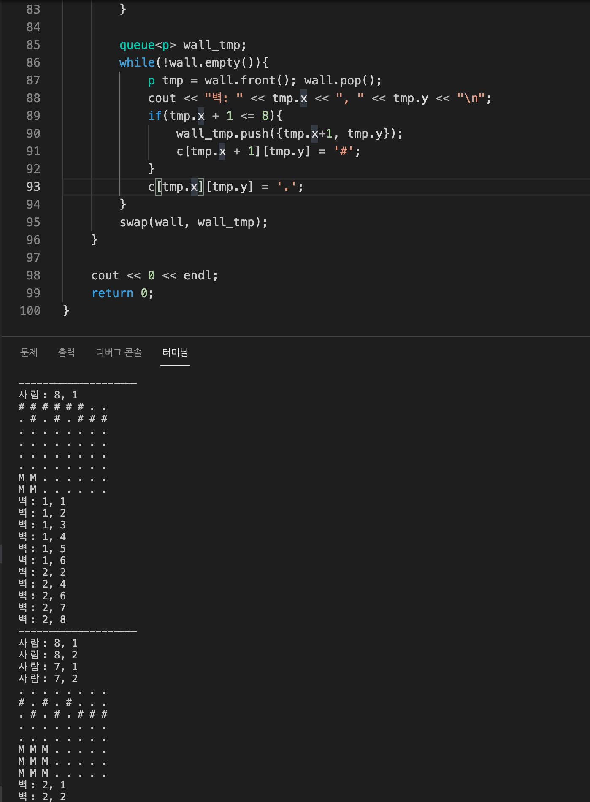

## 문제 해결 과정 정리
* sol1.cpp -> 실패했던 풀이
  * ✅ 이유: 벽이 수직으로 나열되어 있는 경우, 이 때에 떨어지는 과정을 제대로 처리하지 못했음
  * ✅ 문제발견: https://www.acmicpc.net/board/view/84786 의 테스트케이스로 직접 출력문으로 확인해가며 원인 발견
  
  * 다음 사진과 같이 벽이 수직으로 나열된 경우에, 벽이 아래로 이동하는 처리를 제대로 하지 못함
    * 이후에 벽으로 갱신되는 것을 먼저 해주고('#') 그 뒤에 ('.')으로 해주었더니 생긴 문제였다
    * 복귀와 갱신이 왔다갔다 반복적으로 일어나서 생긴 문제였음
      * --> 이전 과정에서 갱신이 되었던 부분이 이후 과정의 복귀 과정에서 덮어씌어 생긴 문제였음 !!
  * ✅ 해결: 원래 자리를 ('.')으로 일괄 처리해주고 이후에 한꺼번에 벽('#')으로 갱신되는 과정을 일괄로 처리해주었다.


* 틀린 코드 부분

```
        queue<p> wall_tmp;
        while(!wall.empty()){
            p tmp = wall.front(); wall.pop();
            // cout << "벽: " << tmp.x << ", " << tmp.y << "\n";
            if(tmp.x + 1 <= 8){
                wall_tmp.push({tmp.x+1, tmp.y});
                c[tmp.x + 1][tmp.y] = '#';
            }
            c[tmp.x][tmp.y] = '.';
        }
        swap(wall, wall_tmp);
```

* 해결한 코드 부분

```
        queue<p> wall_tmp;
        while(!wall.empty()){
            p tmp = wall.front(); wall.pop();
            if(tmp.x + 1 <= 8){
                wall_tmp.push({tmp.x+1, tmp.y});
            }
            c[tmp.x][tmp.y] = '.'; // 먼저 원상복귀 시켜놓은 다음
        }
        while(!wall_tmp.empty()){
            p tmp = wall_tmp.front(); wall_tmp.pop();
            c[tmp.x][tmp.y] = '#'; // '벽'으로 갱신되어야 하는 부분을 한꺼번에 일괄처리
            wall.push(tmp);
        }
    }
```


## 기억해야 할 부분

* 원상 복귀와 갱신이 반복적으로 일어나면, 이전 갱신과정이 이후 복귀과정에서 덮어씌어질 수 있음
  * 복귀와 갱신 과정을 따로따로 한꺼번에 처리해주자
  