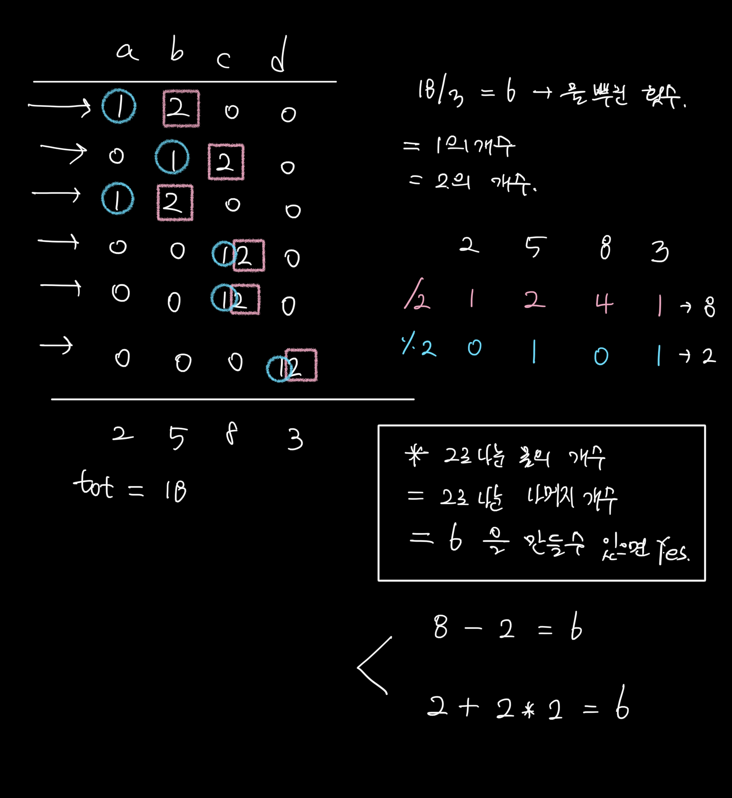

## 사과나무 🍏

처음 생각해내는게 어려웠던 문제..   
사고 과정을 그림으로 남겨봤다

즉 전체 tot = 물을 뿌린 횟수라 하면,   

> tot = 1의 개수 = 2의 개수

이거를 만들어 줄 수 있으면 yes를 출력하면 되고,   
만들 수 없으면 no를 출력하면 된다   

그리디 문제보다는 .. 그냥 수학적인 사고를 요구하는 문제인 것 같았다