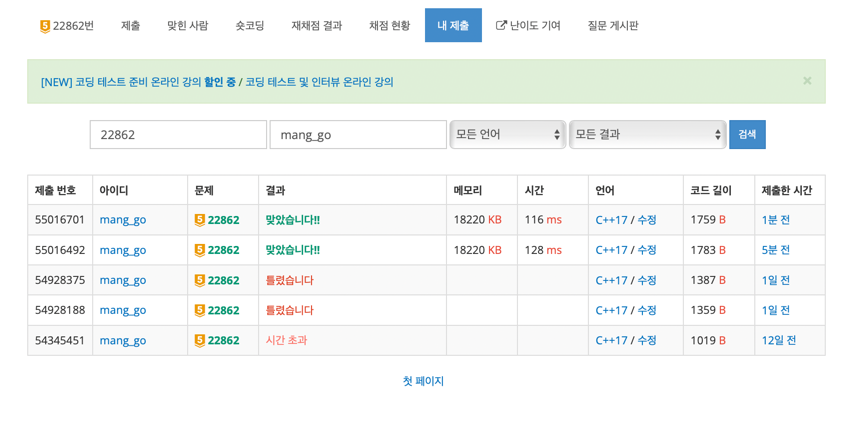
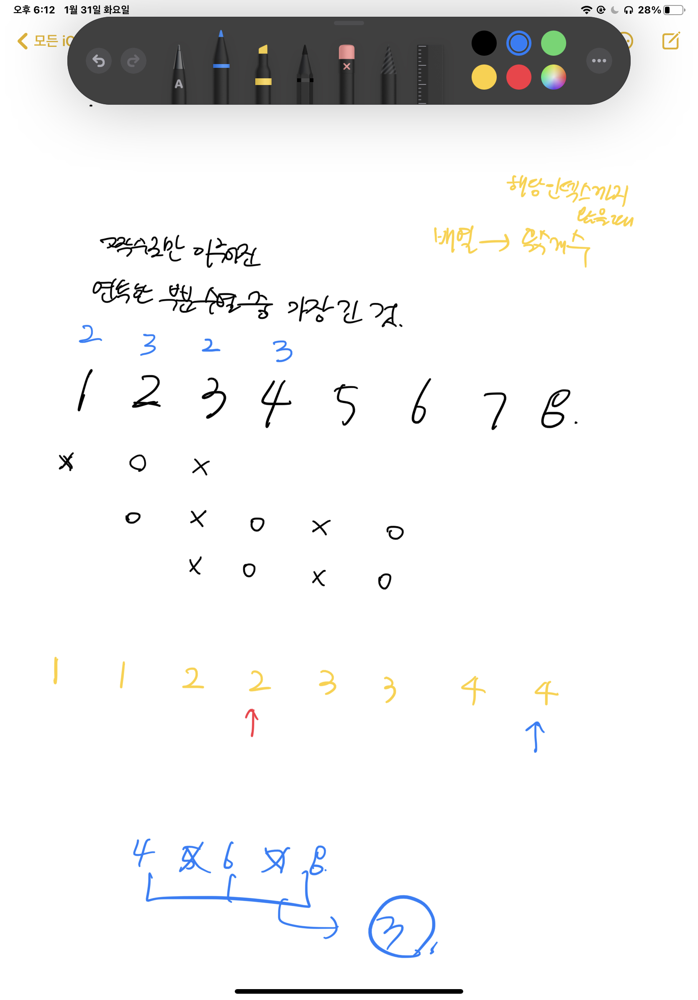

## 가장 긴 짝수 연속한 부분 수열 (large)



무려 2주 전에 실패하고 다른 투포인터 풀다가 다시 돌아와서 풀어서 맞게 된 문제이다 !!   
다시 풀때에는 직접 시뮬레이션 과정을 그려보았는데   



역시 시뮬레이션 과정은 직접 그려보아야 한다.. 그래야 어떻게 코드를 짤지 감이 잡히는 것 같다.   


시간복잡도를 고려해보았을 때에는 N번을 돌면서 매 번 해당 idx에서 최대 길이를 구하려고하면 시간초과가 날 수밖에 없다.   
-> 따라서 투포인터를 이용하여 이를 통제해야한다.   

슬라이딩윈도우 기법과 투포인터가 합쳐진 문제인 것 같다.

* 슬라이딩 윈도우: 해당 idx까지 왔을 때의 홀수항 개수를 담은 배열을 선언함 -> count 배열
* 투포인터: l, r를 이용
  * l : 수열의 첫 시작 부분
  * r : 수열의 끝 부분


> ### 알고리즘의 진행 과정은 다음과 같다.
>
> 1. l과, r 모두 idx 가 0인 항에서 시작한다.
> 2. 수열 시작이 l일때 최대한 갈 수 있는 r을 구한다. (최대한 오른쪽으로 갈 수 있을만큼)   
>   (최대로 이동했을 때 길이는 계속 갱신해줌)
> 3. 이후 l을 오른쪽으로 한 칸 이동시키고 위의 2의 과정을 반복한다.


### ✔️ 기타
답은 연속한 짝수 수열의 길이이고, 이를 위해서는   
```(전체 수열이 길이) - (사이에 있는 홀수 항의 개수)``` 를 구해야 한다.   
l과 r 사이의 홀수 항의 개수를 구하는 부분에서 애를 먹었다.   

홀홀/홀짝/짝홀/짝짝 의 경우가 모두 다르며,   
이를 경우를 나눠서 직접 계산해주어야만 했었다.   
해당 부분의 코드는 다음과 같다.   


```cpp
        // l 과 r 사이 홀수의 개수 구하기
        if(v[l]%2 == 1 && v[r]%2 == 1) { // 홀 홀
            totOdd = count[r] - count[l] + 1;
        }
        else if(v[l]%2 == 1 && v[r]%2 == 0) { // 홀 짝
            totOdd = count[r] - count[l] + 1;
        }
        else if(v[l]%2 == 0 && v[r]%2 == 1) { // 짝 홀
            totOdd = count[r] - count[l];
        }
        else { // 짝 짝
            totOdd = count[r] - count[l];
        }
```


### 🙆🏻‍♀ ️느낀점
* 투포인터, 누적합, 슬라이딩윈도우는 세트로 생각해서 가져가면 좋을 것 같다.
  * 얘네들이 합쳐져서 문제로 나오는 경우가 많은 것 같다.
* 구현문제나 투포인터도 알고리즘 작동 과정을 직접 손으로 그려보면서 하면 좋은 것 같다.
  * -> 눈으로 대충 문제읽고 코드를 짜지 말자 !!! 헷갈리면 작동과정을 직접 해 볼것.